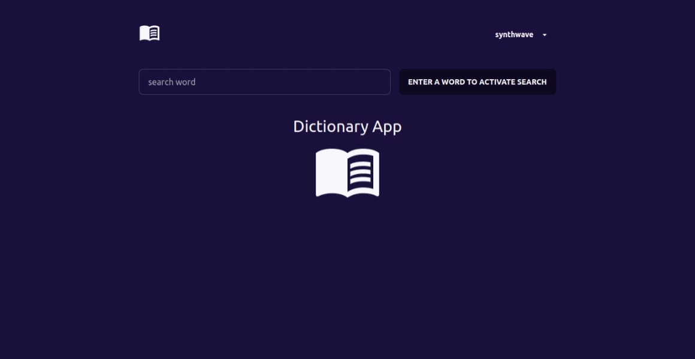
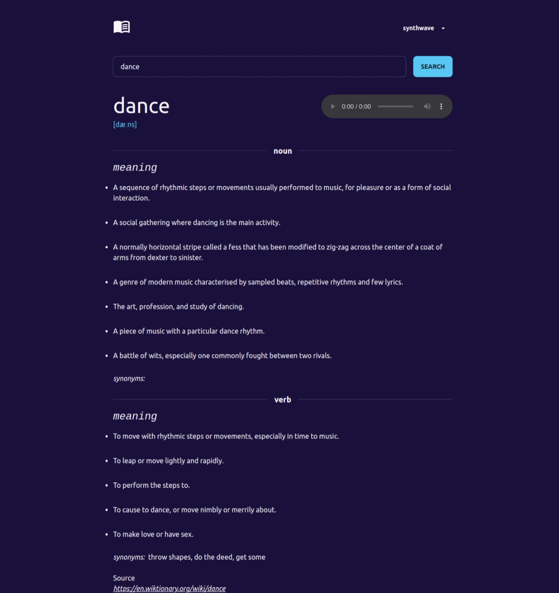

# Dictionary Application

A Vue.js application that allows users to search for word definitions and phonetics. Users can enter a word in the search field and retrieve its definition, part of speech, example sentences, and phonetic pronunciation. The application utilizes a dictionary API to fetch the word data and provide accurate and comprehensive information.

## Technologies Used
- Vue.js
- Dictionary API
- Tailwindcss
- daisyUi

## Installation
1. Clone the repository: `git clone https://github.com/Ericwiz/Dictionary-app`
2. Navigate to the project directory: `cd Dictionary-app`
3. Install dependencies: `npm install`

## Usage
1. Start the application: `npm run dev`
2. Open your web browser and access the application at `http://localhost:5173`.
3. Enter a word in the search field and press the "Search".
4. View the definition, part of speech, example sentences, and phonetic pronunciation of the word.
5. Explore additional features and information provided by the application.
6. Repeat the search process to look up different words and their definitions.

## Screenshots

## Features
- Word search functionality to retrieve word definitions.
- Display of the word's part of speech and phonetic pronunciation.
- Example sentences to provide context and usage of the word.
- User-friendly interface for easy navigation and interaction.
- Responsive design for optimal viewing on various devices.
- audio playback functionality on large screen sizes to listen to the phonetic pronunciation of the word.
- Ability to choose between light, dark or any other theme modes.

## API Integration
The application integrates with a dictionary API to fetch word data for the searched word. It utilizes API endpoints to retrieve definitions, part of speech, example sentences, and phonetic information.

## Challenges Faced
During the development process, some challenges were encountered in handling API responses and rendering data dynamically especially since this was my first time using the vue.js composition api. However, with proper error handling and Vue.js reactive features, I was able to address these challenges.

## Future Enhancements
- Implement a favorite words feature to allow users to save and access frequently searched words.
- Add audio playback functionality on all screen sizes to listen to the phonetic pronunciation of the word.
- Enhance the user interface with more interactive elements and visual enhancements.
- Include additional language support and translation options.
- Improve search performance and optimize API requests.

## Acknowledgments
- The Vue.js documentation and community for providing valuable resources.
- The dictionary API for providing comprehensive and accurate word data.

## License
<!-- This project is licensed under the MIT License. See the [LICENSE](LICENSE) file for more details. -->

## Contact Information
For any questions or feedback, please reach out to [wisdomagu44@gmail.com](wisdomagu44@gmail.com).

## References
- [Vue.js documentation](https://vuejs.org/guide/introduction.html)
- [Dictionary API documentation](https://dictionaryapi.dev/)
